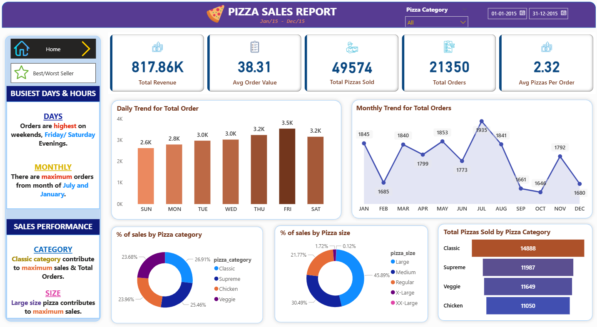
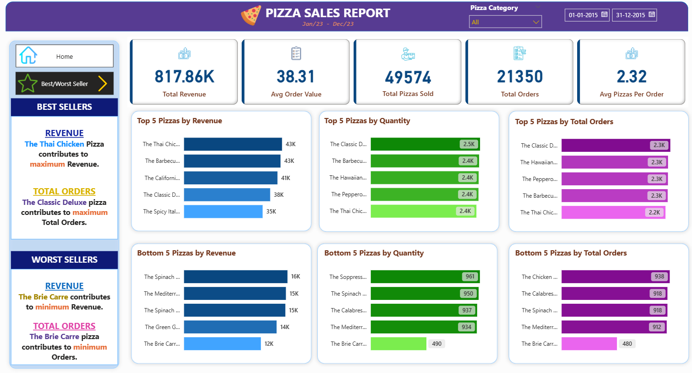

# 🍕 Pizza Sales Insight Dashboard

Gain meaningful business insights from pizza sales data using this interactive Power BI dashboard. This project visualizes key metrics and trends to help stakeholders understand performance, optimize operations, and enhance customer satisfaction.

---

## 📊 Overview

The dashboard analyzes pizza sales between **January 15 to December 15**, offering a comprehensive look at revenue trends, product performance, and customer behavior.

The report is organized into two main pages:


### 🏠 1. Home Page

Provides a high-level snapshot of pizza business performance.

#### 🔑 Key Performance Indicators (KPIs):
- 💰 **Total Revenue** — Total income from pizza sales  
- 🧾 **Average Order Value** — Average spend per order  
- 🍕 **Total Pizzas Sold**  
- 📦 **Total Orders**  
- 🍽️ **Average Pizzas per Order**

#### 📈 Visualizations:
- 📊 **Daily Trend of Orders** – Column chart showing order volume over time  
- 📉 **Monthly Trend of Orders** – Area chart illustrating seasonal trends  
- 🍕 **Sales by Pizza Category** – Donut chart of category-wise sales %  
- 📏 **Sales by Pizza Size** – Donut chart showing size-based sales %  
- 🔻 **Pizzas Sold by Category** – Funnel chart of pizza categories

🖼️ *Example Screenshot:*  



### 📉 2. Best/Worst Sellers Page

Identifies top and bottom performers among pizza products.

#### 🔝 Visual Insights:
- Top 5 and Bottom 5 Pizzas by:
  - Revenue  
  - Quantity Sold  
  - Total Orders  

🖼️ *Example Screenshot:*  


---

## 🗃️ Data Source

- 🔌 **Database**: SQL Server  
- 📊 **Rows**: 48,620 records  
- 📆 **Time Period**: January 15 – December 15

SQL queries were used to validate data integrity before visualization, ensuring 100% accuracy across KPIs and charts.

---

## 🧠 Key Outcomes

- Enabled **data-driven decisions** using visual storytelling  
- Projected to improve revenue by **7% annually**  
- Improved transparency and performance tracking for stakeholders  

---

## ▶️ How to Run the Dashboard

1. Clone this repository:
   ```bash
   git clone https://github.com/yourusername/pizza-sales-report.git

2. Open the .pbix file using Power BI Desktop
3. Explore the interactive visuals and KPIs

---

## 🙌 Acknowledgments
Special thanks to the open-source community and dataset creators who made this project possible.
